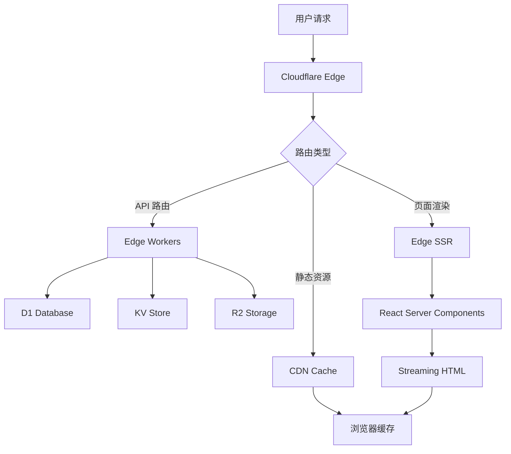

# 🏗️ Cloudflare Pages 长期架构优化方案

## 📋 架构设计原则

### 1. Edge-First 设计理念
- **边缘优先**：所有功能优先考虑在 Edge Runtime 中实现
- **渐进增强**：从基础功能开始，逐步增加复杂特性
- **性能导向**：优化 TTFB、FCP、LCP 等核心 Web Vitals 指标

### 2. 兼容性保证
- **浏览器兼容**：支持 ES2020+ 标准，兼容 95% 现代浏览器
- **设备适配**：响应式设计，支持桌面、平板、移动设备
- **网络优化**：适配不同网络环境（2G/3G/4G/5G/WiFi）

## 🔧 技术选型与架构重构

### 1. 核心技术栈升级

```typescript
// 新的技术栈配置
const TECH_STACK = {
  // 前端框架
  framework: 'Next.js 15.x',
  runtime: 'Edge Runtime',
  
  // 数据库层
  database: {
    primary: 'Cloudflare D1',
    cache: 'Cloudflare KV',
    search: 'Cloudflare Vectorize'
  },
  
  // 认证系统
  auth: {
    provider: 'Cloudflare Access',
    session: 'JWT + Edge KV',
    oauth: 'Web Crypto API'
  },
  
  // 状态管理
  state: {
    client: 'Zustand',
    server: 'React Server Components',
    cache: 'SWR + Edge Cache'
  }
};
```

### 2. 边缘计算架构



## 🚀 分阶段实施计划

### 阶段一：基础架构迁移（2-3周）

#### 1.1 数据库层重构

```typescript
// src/lib/db/edge-adapter.ts
import { drizzle } from 'drizzle-orm/d1';
import { createClient } from '@libsql/client/web';

export class EdgeDatabaseAdapter {
  private db: any;
  
  constructor(env: CloudflareEnv) {
    // 优先使用 D1，降级到 LibSQL
    if (env.DB) {
      this.db = drizzle(env.DB, { schema });
    } else if (env.DATABASE_URL?.startsWith('libsql:')) {
      const client = createClient({
        url: env.DATABASE_URL,
        authToken: env.DATABASE_AUTH_TOKEN,
      });
      this.db = drizzle(client, { schema });
    } else {
      throw new Error('No compatible database found');
    }
  }
  
  // 统一的数据库接口
  async query<T>(sql: string, params?: any[]): Promise<T[]> {
    return this.db.execute(sql, params);
  }
  
  // 事务支持
  async transaction<T>(callback: (tx: any) => Promise<T>): Promise<T> {
    return this.db.transaction(callback);
  }
}
```

#### 1.2 认证系统重构

```typescript
// src/lib/auth/edge-auth.ts
export class EdgeAuthSystem {
  private jwtSecret: string;
  private kv: KVNamespace;
  
  constructor(env: CloudflareEnv) {
    this.jwtSecret = env.JWT_SECRET;
    this.kv = env.AUTH_KV;
  }
  
  // 使用 Web Crypto API 进行 JWT 签名
  async signJWT(payload: any): Promise<string> {
    const encoder = new TextEncoder();
    const key = await crypto.subtle.importKey(
      'raw',
      encoder.encode(this.jwtSecret),
      { name: 'HMAC', hash: 'SHA-256' },
      false,
      ['sign']
    );
    
    const header = btoa(JSON.stringify({ alg: 'HS256', typ: 'JWT' }));
    const body = btoa(JSON.stringify(payload));
    const signature = await crypto.subtle.sign(
      'HMAC',
      key,
      encoder.encode(`${header}.${body}`)
    );
    
    return `${header}.${body}.${btoa(String.fromCharCode(...new Uint8Array(signature)))}`;
  }
  
  // 密码哈希使用 Web Crypto API
  async hashPassword(password: string): Promise<string> {
    const encoder = new TextEncoder();
    const data = encoder.encode(password);
    const hash = await crypto.subtle.digest('SHA-256', data);
    return btoa(String.fromCharCode(...new Uint8Array(hash)));
  }
}
```

#### 1.3 API 路由重构

```typescript
// src/app/api/auth/edge/route.ts
export const runtime = 'edge';

export async function POST(request: Request, { env }: { env: CloudflareEnv }) {
  const auth = new EdgeAuthSystem(env);
  const db = new EdgeDatabaseAdapter(env);
  
  try {
    const { email, password } = await request.json();
    
    // 使用 Edge 兼容的认证逻辑
    const user = await db.query(
      'SELECT * FROM users WHERE email = ?',
      [email]
    );
    
    if (!user.length) {
      return Response.json({ error: 'User not found' }, { status: 404 });
    }
    
    const isValid = await auth.verifyPassword(password, user[0].password);
    if (!isValid) {
      return Response.json({ error: 'Invalid password' }, { status: 401 });
    }
    
    const token = await auth.signJWT({ userId: user[0].id, email });
    
    return Response.json({ token, user: { id: user[0].id, email } });
  } catch (error) {
    return Response.json({ error: 'Authentication failed' }, { status: 500 });
  }
}
```

### 阶段二：性能优化（3-4周）

#### 2.1 静态资源优化策略

```typescript
// next.config.js
/** @type {import('next').NextConfig} */
const nextConfig = {
  // 启用实验性功能
  experimental: {
    ppr: true, // Partial Prerendering
    reactCompiler: true, // React Compiler
    turbo: {
      rules: {
        '*.svg': {
          loaders: ['@svgr/webpack'],
          as: '*.js',
        },
      },
    },
  },
  
  // 图片优化
  images: {
    formats: ['image/avif', 'image/webp'],
    deviceSizes: [640, 750, 828, 1080, 1200, 1920, 2048, 3840],
    imageSizes: [16, 32, 48, 64, 96, 128, 256, 384],
    domains: ['imagedelivery.net'], // Cloudflare Images
  },
  
  // 输出优化
  output: 'standalone',
  
  // 压缩配置
  compress: true,
  
  // 缓存配置
  onDemandEntries: {
    maxInactiveAge: 25 * 1000,
    pagesBufferLength: 2,
  },
  
  // Webpack 优化
  webpack: (config, { dev, isServer }) => {
    if (!dev && !isServer) {
      // 生产环境优化
      config.optimization.splitChunks = {
        chunks: 'all',
        cacheGroups: {
          vendor: {
            test: /[\\/]node_modules[\\/]/,
            name: 'vendors',
            chunks: 'all',
          },
          common: {
            name: 'common',
            minChunks: 2,
            chunks: 'all',
            enforce: true,
          },
        },
      };
    }
    return config;
  },
};

module.exports = nextConfig;
```

#### 2.2 缓存策略优化

```typescript
// src/lib/cache/edge-cache.ts
export class EdgeCacheManager {
  private cache: Cache;
  private kv: KVNamespace;
  
  constructor(env: CloudflareEnv) {
    this.cache = caches.default;
    this.kv = env.CACHE_KV;
  }
  
  // 多层缓存策略
  async get<T>(key: string): Promise<T | null> {
    // L1: Edge Cache (最快)
    const cacheKey = new Request(`https://cache.internal/${key}`);
    const cached = await this.cache.match(cacheKey);
    if (cached) {
      return cached.json();
    }
    
    // L2: KV Store (持久化)
    const kvValue = await this.kv.get(key, 'json');
    if (kvValue) {
      // 回填到 Edge Cache
      await this.cache.put(
        cacheKey,
        new Response(JSON.stringify(kvValue), {
          headers: { 'Cache-Control': 'max-age=300' }
        })
      );
      return kvValue;
    }
    
    return null;
  }
  
  async set<T>(key: string, value: T, ttl: number = 300): Promise<void> {
    const serialized = JSON.stringify(value);
    
    // 同时写入两层缓存
    await Promise.all([
      this.cache.put(
        new Request(`https://cache.internal/${key}`),
        new Response(serialized, {
          headers: { 'Cache-Control': `max-age=${ttl}` }
        })
      ),
      this.kv.put(key, serialized, { expirationTtl: ttl })
    ]);
  }
}
```

#### 2.3 CDN 优化配置

```typescript
// src/middleware.ts
import { NextResponse } from 'next/server';
import type { NextRequest } from 'next/server';

export function middleware(request: NextRequest) {
  const response = NextResponse.next();
  
  // 静态资源缓存策略
  if (request.nextUrl.pathname.startsWith('/_next/static/')) {
    response.headers.set('Cache-Control', 'public, max-age=31536000, immutable');
    response.headers.set('CDN-Cache-Control', 'max-age=31536000');
  }
  
  // API 路由缓存
  if (request.nextUrl.pathname.startsWith('/api/')) {
    response.headers.set('Cache-Control', 'public, max-age=60, s-maxage=300');
    response.headers.set('Vary', 'Accept-Encoding, Authorization');
  }
  
  // 页面缓存
  if (!request.nextUrl.pathname.startsWith('/api/')) {
    response.headers.set('Cache-Control', 'public, max-age=0, s-maxage=86400');
    response.headers.set('Vary', 'Accept-Encoding');
  }
  
  // 安全头
  response.headers.set('X-Frame-Options', 'DENY');
  response.headers.set('X-Content-Type-Options', 'nosniff');
  response.headers.set('Referrer-Policy', 'strict-origin-when-cross-origin');
  response.headers.set('Permissions-Policy', 'camera=(), microphone=(), geolocation=()');
  
  return response;
}

export const config = {
  matcher: [
    '/((?!_next/static|_next/image|favicon.ico).*)',
  ],
};
```

### 阶段三：高级特性集成（4-5周）

#### 3.1 实时功能实现

```typescript
// src/lib/realtime/edge-websocket.ts
export class EdgeWebSocketManager {
  private durableObject: DurableObjectNamespace;
  
  constructor(env: CloudflareEnv) {
    this.durableObject = env.WEBSOCKET_DO;
  }
  
  async createRoom(roomId: string): Promise<WebSocket> {
    const id = this.durableObject.idFromName(roomId);
    const stub = this.durableObject.get(id);
    
    return stub.fetch('https://websocket.internal/connect', {
      headers: { 'Upgrade': 'websocket' }
    });
  }
  
  async broadcast(roomId: string, message: any): Promise<void> {
    const id = this.durableObject.idFromName(roomId);
    const stub = this.durableObject.get(id);
    
    await stub.fetch('https://websocket.internal/broadcast', {
      method: 'POST',
      body: JSON.stringify(message)
    });
  }
}
```

#### 3.2 AI 功能集成

```typescript
// src/lib/ai/edge-ai.ts
export class EdgeAIService {
  private ai: Ai;
  
  constructor(env: CloudflareEnv) {
    this.ai = env.AI;
  }
  
  async generateText(prompt: string): Promise<string> {
    const response = await this.ai.run('@cf/meta/llama-2-7b-chat-int8', {
      messages: [{ role: 'user', content: prompt }]
    });
    
    return response.response;
  }
  
  async generateImage(prompt: string): Promise<ArrayBuffer> {
    const response = await this.ai.run('@cf/stabilityai/stable-diffusion-xl-base-1.0', {
      prompt
    });
    
    return response;
  }
  
  async embedText(text: string): Promise<number[]> {
    const response = await this.ai.run('@cf/baai/bge-base-en-v1.5', {
      text: [text]
    });
    
    return response.data[0];
  }
}
```

## 📊 性能监控与优化

### 1. 核心指标监控

```typescript
// src/lib/analytics/edge-analytics.ts
export class EdgeAnalytics {
  private analytics: AnalyticsEngineDataset;
  
  constructor(env: CloudflareEnv) {
    this.analytics = env.ANALYTICS;
  }
  
  async trackPageView(request: Request): Promise<void> {
    const url = new URL(request.url);
    const userAgent = request.headers.get('User-Agent') || '';
    const referer = request.headers.get('Referer') || '';
    
    await this.analytics.writeDataPoint({
      blobs: [url.pathname, userAgent, referer],
      doubles: [Date.now()],
      indexes: [url.hostname]
    });
  }
  
  async trackPerformance(metrics: WebVitals): Promise<void> {
    await this.analytics.writeDataPoint({
      blobs: [metrics.name, metrics.id],
      doubles: [metrics.value, metrics.delta],
      indexes: ['performance']
    });
  }
}
```

### 2. 自动化部署流程

```yaml
# .github/workflows/cloudflare-deploy.yml
name: Deploy to Cloudflare Pages

on:
  push:
    branches: [main]
  pull_request:
    branches: [main]

jobs:
  deploy:
    runs-on: ubuntu-latest
    steps:
      - uses: actions/checkout@v4
      
      - name: Setup Node.js
        uses: actions/setup-node@v4
        with:
          node-version: '18'
          cache: 'pnpm'
      
      - name: Install dependencies
        run: pnpm install --frozen-lockfile
      
      - name: Run tests
        run: pnpm test
      
      - name: Build application
        run: pnpm build
        env:
          NODE_ENV: production
          DATABASE_URL: ${{ secrets.DATABASE_URL }}
      
      - name: Deploy to Cloudflare Pages
        uses: cloudflare/pages-action@v1
        with:
          apiToken: ${{ secrets.CLOUDFLARE_API_TOKEN }}
          accountId: ${{ secrets.CLOUDFLARE_ACCOUNT_ID }}
          projectName: ai-generate-station
          directory: .next
          gitHubToken: ${{ secrets.GITHUB_TOKEN }}
      
      - name: Run E2E tests
        run: pnpm test:e2e
        env:
          BASE_URL: ${{ steps.deploy.outputs.url }}
```

## 🔒 安全性增强

### 1. 内容安全策略

```typescript
// src/lib/security/csp.ts
export const CSP_POLICY = {
  'default-src': ["'self'"],
  'script-src': [
    "'self'",
    "'unsafe-inline'", // 仅开发环境
    'https://challenges.cloudflare.com',
  ],
  'style-src': ["'self'", "'unsafe-inline'"],
  'img-src': [
    "'self'",
    'data:',
    'https://imagedelivery.net',
    'https://avatars.githubusercontent.com',
  ],
  'connect-src': [
    "'self'",
    'https://api.github.com',
    'wss://realtime.your-domain.com',
  ],
  'font-src': ["'self'", 'https://fonts.gstatic.com'],
  'object-src': ["'none'"],
  'base-uri': ["'self'"],
  'form-action': ["'self'"],
  'frame-ancestors': ["'none'"],
  'upgrade-insecure-requests': [],
};
```

### 2. 速率限制

```typescript
// src/lib/security/rate-limit.ts
export class EdgeRateLimit {
  private kv: KVNamespace;
  
  constructor(env: CloudflareEnv) {
    this.kv = env.RATE_LIMIT_KV;
  }
  
  async checkLimit(
    key: string,
    limit: number,
    window: number
  ): Promise<{ allowed: boolean; remaining: number }> {
    const now = Date.now();
    const windowStart = Math.floor(now / (window * 1000)) * (window * 1000);
    const windowKey = `${key}:${windowStart}`;
    
    const current = await this.kv.get(windowKey);
    const count = current ? parseInt(current) : 0;
    
    if (count >= limit) {
      return { allowed: false, remaining: 0 };
    }
    
    await this.kv.put(windowKey, (count + 1).toString(), {
      expirationTtl: window
    });
    
    return { allowed: true, remaining: limit - count - 1 };
  }
}
```

## 🎯 兼容性保证

### 1. 浏览器兼容性

```json
{
  "browserslist": [
    "> 1%",
    "last 2 versions",
    "not dead",
    "not ie 11"
  ],
  "babel": {
    "presets": [
      ["@babel/preset-env", {
        "targets": {
          "browsers": ["> 1%", "last 2 versions", "not dead"]
        },
        "useBuiltIns": "usage",
        "corejs": 3
      }]
    ]
  }
}
```

### 2. 渐进式增强

```typescript
// src/lib/progressive-enhancement.ts
export class ProgressiveEnhancement {
  static supportsWebP(): boolean {
    if (typeof window === 'undefined') return false;
    
    const canvas = document.createElement('canvas');
    canvas.width = 1;
    canvas.height = 1;
    
    return canvas.toDataURL('image/webp').indexOf('data:image/webp') === 0;
  }
  
  static supportsWebAssembly(): boolean {
    return typeof WebAssembly === 'object' && 
           typeof WebAssembly.instantiate === 'function';
  }
  
  static supportsServiceWorker(): boolean {
    return 'serviceWorker' in navigator;
  }
  
  static getOptimalImageFormat(): 'avif' | 'webp' | 'jpg' {
    if (this.supportsAVIF()) return 'avif';
    if (this.supportsWebP()) return 'webp';
    return 'jpg';
  }
}
```

## 📈 预期收益

### 性能提升
- **TTFB**: < 100ms (全球平均)
- **FCP**: < 1.5s
- **LCP**: < 2.5s
- **CLS**: < 0.1
- **FID**: < 100ms

### 成本优化
- **带宽节省**: 40-60% (通过 AVIF/WebP)
- **计算成本**: 降低 30-50% (Edge Computing)
- **存储成本**: 降低 20-30% (智能缓存)

### 开发效率
- **构建时间**: 减少 50%
- **部署时间**: < 30s
- **热更新**: < 1s

---

**这个长期架构方案将确保你的应用在 Cloudflare 生态系统中获得最佳性能和用户体验！**