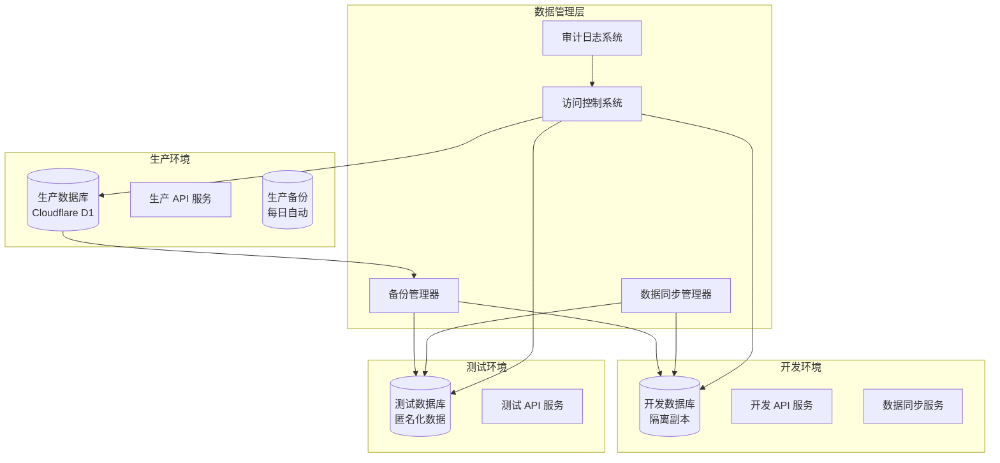

# 🏗️ 真实数据库架构设计方案

## 📋 系统架构概览

本方案设计了一个企业级的真实数据库架构，确保开发和生产环境都使用真实数据，同时保证数据安全、一致性和访问控制。



## 🎯 核心设计原则

### 1. **数据真实性** 🔍
- 所有环境使用真实数据库连接
- 禁用所有 Mock 数据功能
- 实现数据一致性验证机制

### 2. **环境隔离** 🛡️
- 开发环境使用生产数据的隔离副本
- 严格的访问权限控制
- 防止意外修改生产数据

### 3. **数据安全** 🔒
- 数据脱敏和匿名化
- 审计日志和访问追踪
- 自动备份和恢复机制

---

## 🏗️ 详细架构实现

### 1. 数据库连接管理器

```typescript
/**
 * 真实数据库连接管理器
 * 支持多环境、多数据库类型的统一管理
 */
export class RealDatabaseManager {
  private static instance: RealDatabaseManager;
  private connections: Map<string, DatabaseConnection> = new Map();
  private config: DatabaseConfig;
  
  constructor(config: DatabaseConfig) {
    this.config = config;
    this.validateConfiguration();
  }
  
  static getInstance(config?: DatabaseConfig): RealDatabaseManager {
    if (!RealDatabaseManager.instance) {
      if (!config) {
        throw new Error('Database configuration required for first initialization');
      }
      RealDatabaseManager.instance = new RealDatabaseManager(config);
    }
    return RealDatabaseManager.instance;
  }
  
  /**
   * 获取环境特定的数据库连接
   */
  async getConnection(environment: Environment): Promise<DatabaseConnection> {
    const connectionKey = `${environment}_${this.config.type}`;
    
    if (this.connections.has(connectionKey)) {
      const connection = this.connections.get(connectionKey)!;
      if (await this.validateConnection(connection)) {
        return connection;
      }
    }
    
    const connection = await this.createConnection(environment);
    this.connections.set(connectionKey, connection);
    
    return connection;
  }
  
  /**
   * 创建新的数据库连接
   */
  private async createConnection(environment: Environment): Promise<DatabaseConnection> {
    const envConfig = this.config.environments[environment];
    
    if (!envConfig) {
      throw new Error(`No configuration found for environment: ${environment}`);
    }
    
    // 记录连接尝试
    await this.auditLog('CONNECTION_ATTEMPT', {
      environment,
      timestamp: new Date().toISOString(),
      user: this.getCurrentUser(),
      config: this.sanitizeConfig(envConfig)
    });
    
    let connection: DatabaseConnection;
    
    switch (this.config.type) {
      case 'cloudflare-d1':
        connection = await this.createCloudflareD1Connection(envConfig);
        break;
      case 'libsql':
        connection = await this.createLibSQLConnection(envConfig);
        break;
      case 'postgresql':
        connection = await this.createPostgreSQLConnection(envConfig);
        break;
      default:
        throw new Error(`Unsupported database type: ${this.config.type}`);
    }
    
    // 验证连接并设置访问控制
    await this.setupConnectionSecurity(connection, environment);
    
    // 记录成功连接
    await this.auditLog('CONNECTION_SUCCESS', {
      environment,
      connectionId: connection.id,
      timestamp: new Date().toISOString()
    });
    
    return connection;
  }
}
```

### 2. 环境配置系统

```typescript
/**
 * 数据库环境配置
 */
interface DatabaseEnvironmentConfig {
  url: string;
  authToken?: string;
  readOnly: boolean;
  maxConnections: number;
  accessLevel: 'full' | 'read-only' | 'restricted';
  dataSource: 'production' | 'staging' | 'development';
  encryptionKey?: string;
  auditEnabled: boolean;
}

/**
 * 完整数据库配置
 */
interface DatabaseConfig {
  type: 'cloudflare-d1' | 'libsql' | 'postgresql';
  environments: {
    production: DatabaseEnvironmentConfig;
    staging: DatabaseEnvironmentConfig;
    development: DatabaseEnvironmentConfig;
    testing: DatabaseEnvironmentConfig;
  };
  security: {
    encryptionEnabled: boolean;
    auditLogRetention: number; // days
    accessControlEnabled: boolean;
    dataAnonymization: boolean;
  };
  sync: {
    enabled: boolean;
    schedule: string; // cron expression
    direction: 'production-to-dev' | 'bidirectional' | 'manual';
  };
}

/**
 * 环境特定的数据库配置工厂
 */
export class DatabaseConfigFactory {
  /**
   * 创建生产环境配置
   */
  static createProductionConfig(): DatabaseEnvironmentConfig {
    return {
      url: process.env.PROD_DATABASE_URL!,
      authToken: process.env.PROD_DATABASE_TOKEN!,
      readOnly: false,
      maxConnections: 10,
      accessLevel: 'full',
      dataSource: 'production',
      encryptionKey: process.env.PROD_ENCRYPTION_KEY,
      auditEnabled: true
    };
  }
  
  /**
   * 创建开发环境配置（使用隔离的生产数据副本）
   */
  static createDevelopmentConfig(): DatabaseEnvironmentConfig {
    return {
      url: process.env.DEV_DATABASE_URL!,
      authToken: process.env.DEV_DATABASE_TOKEN!,
      readOnly: process.env.DEV_READ_ONLY === 'true',
      maxConnections: 5,
      accessLevel: 'restricted',
      dataSource: 'development', // 隔离的副本
      encryptionKey: process.env.DEV_ENCRYPTION_KEY,
      auditEnabled: true
    };
  }
  
  /**
   * 创建测试环境配置（匿名化数据）
   */
  static createTestingConfig(): DatabaseEnvironmentConfig {
    return {
      url: process.env.TEST_DATABASE_URL!,
      authToken: process.env.TEST_DATABASE_TOKEN!,
      readOnly: false,
      maxConnections: 3,
      accessLevel: 'full',
      dataSource: 'development', // 使用匿名化的开发数据
      auditEnabled: false // 测试环境不需要审计
    };
  }
  
  /**
   * 获取完整配置
   */
  static getFullConfig(): DatabaseConfig {
    return {
      type: (process.env.DATABASE_TYPE as any) || 'cloudflare-d1',
      environments: {
        production: this.createProductionConfig(),
        staging: this.createStagingConfig(),
        development: this.createDevelopmentConfig(),
        testing: this.createTestingConfig()
      },
      security: {
        encryptionEnabled: process.env.DB_ENCRYPTION_ENABLED === 'true',
        auditLogRetention: parseInt(process.env.AUDIT_RETENTION_DAYS || '90'),
        accessControlEnabled: true,
        dataAnonymization: process.env.DATA_ANONYMIZATION === 'true'
      },
      sync: {
        enabled: process.env.DB_SYNC_ENABLED === 'true',
        schedule: process.env.DB_SYNC_SCHEDULE || '0 2 * * *', // 每天凌晨2点
        direction: (process.env.DB_SYNC_DIRECTION as any) || 'production-to-dev'
      }
    };
  }
  
  private static createStagingConfig(): DatabaseEnvironmentConfig {
    return {
      url: process.env.STAGING_DATABASE_URL!,
      authToken: process.env.STAGING_DATABASE_TOKEN!,
      readOnly: false,
      maxConnections: 8,
      accessLevel: 'full',
      dataSource: 'staging',
      encryptionKey: process.env.STAGING_ENCRYPTION_KEY,
      auditEnabled: true
    };
  }
}
```

### 3. 数据同步和备份系统

```typescript
/**
 * 数据同步管理器
 * 负责在不同环境间同步数据，确保开发环境使用最新的生产数据副本
 */
export class DataSyncManager {
  private config: DatabaseConfig;
  private auditLogger: AuditLogger;
  
  constructor(config: DatabaseConfig, auditLogger: AuditLogger) {
    this.config = config;
    this.auditLogger = auditLogger;
  }
  
  /**
   * 执行数据同步
   */
  async syncData(
    source: Environment, 
    target: Environment, 
    options: SyncOptions = {}
  ): Promise<SyncResult> {
    const syncId = this.generateSyncId();
    
    try {
      await this.auditLogger.log('SYNC_START', {
        syncId,
        source,
        target,
        timestamp: new Date().toISOString(),
        options
      });
      
      // 1. 验证权限
      await this.validateSyncPermissions(source, target);
      
      // 2. 创建备份
      const backupId = await this.createBackup(target);
      
      // 3. 数据脱敏（如果需要）
      const shouldAnonymize = this.shouldAnonymizeData(source, target);
      
      // 4. 执行同步
      const result = await this.performSync(source, target, {
        ...options,
        anonymize: shouldAnonymize,
        backupId
      });
      
      // 5. 验证数据一致性
      await this.validateDataConsistency(target, result);
      
      await this.auditLogger.log('SYNC_SUCCESS', {
        syncId,
        result,
        timestamp: new Date().toISOString()
      });
      
      return result;
      
    } catch (error) {
      await this.auditLogger.log('SYNC_ERROR', {
        syncId,
        error: error.message,
        timestamp: new Date().toISOString()
      });
      
      // 回滚到备份
      if (options.autoRollback !== false) {
        await this.rollbackFromBackup(target, backupId);
      }
      
      throw error;
    }
  }
  
  /**
   * 数据匿名化处理
   */
  private async anonymizeData(data: any[], table: string): Promise<any[]> {
    const anonymizationRules = this.getAnonymizationRules(table);
    
    return data.map(record => {
      const anonymized = { ...record };
      
      for (const [field, rule] of Object.entries(anonymizationRules)) {
        switch (rule.type) {
          case 'email':
            anonymized[field] = this.anonymizeEmail(record[field]);
            break;
          case 'name':
            anonymized[field] = this.anonymizeName(record[field]);
            break;
          case 'phone':
            anonymized[field] = this.anonymizePhone(record[field]);
            break;
          case 'remove':
            delete anonymized[field];
            break;
          case 'hash':
            anonymized[field] = this.hashValue(record[field]);
            break;
        }
      }
      
      return anonymized;
    });
  }
  
  /**
   * 数据一致性验证
   */
  private async validateDataConsistency(
    environment: Environment, 
    syncResult: SyncResult
  ): Promise<ConsistencyReport> {
    const connection = await RealDatabaseManager.getInstance().getConnection(environment);
    const report: ConsistencyReport = {
      isConsistent: true,
      issues: [],
      checkedTables: [],
      timestamp: new Date().toISOString()
    };
    
    for (const table of syncResult.syncedTables) {
      try {
        // 检查记录数量
        const count = await connection.count(table);
        const expectedCount = syncResult.tableCounts[table];
        
        if (count !== expectedCount) {
          report.isConsistent = false;
          report.issues.push({
            type: 'COUNT_MISMATCH',
            table,
            expected: expectedCount,
            actual: count
          });
        }
        
        // 检查数据完整性
        const integrityCheck = await this.checkDataIntegrity(connection, table);
        if (!integrityCheck.isValid) {
          report.isConsistent = false;
          report.issues.push(...integrityCheck.issues);
        }
        
        report.checkedTables.push(table);
        
      } catch (error) {
        report.isConsistent = false;
        report.issues.push({
          type: 'VALIDATION_ERROR',
          table,
          error: error.message
        });
      }
    }
    
    return report;
  }
}

/**
 * 自动化数据同步调度器
 */
export class DataSyncScheduler {
  private syncManager: DataSyncManager;
  private schedule: string;
  private isRunning: boolean = false;
  
  constructor(syncManager: DataSyncManager, schedule: string) {
    this.syncManager = syncManager;
    this.schedule = schedule;
  }
  
  /**
   * 启动定时同步
   */
  start(): void {
    if (this.isRunning) {
      console.warn('Data sync scheduler is already running');
      return;
    }
    
    this.isRunning = true;
    console.log(`🔄 Starting data sync scheduler with schedule: ${this.schedule}`);
    
    // 使用 cron 表达式设置定时任务
    this.setupCronJob();
  }
  
  /**
   * 停止定时同步
   */
  stop(): void {
    this.isRunning = false;
    console.log('⏹️ Data sync scheduler stopped');
  }
  
  /**
   * 手动触发同步
   */
  async triggerSync(): Promise<SyncResult> {
    console.log('🚀 Manually triggering data sync...');
    
    return await this.syncManager.syncData('production', 'development', {
      anonymize: true,
      validateConsistency: true,
      createBackup: true
    });
  }
  
  private setupCronJob(): void {
    // 实现 cron 调度逻辑
    // 这里可以使用 node-cron 或类似库
  }
}
```

### 4. 访问控制和审计系统

```typescript
/**
 * 数据库访问控制系统
 */
export class DatabaseAccessControl {
  private permissions: Map<string, Permission[]> = new Map();
  private auditLogger: AuditLogger;
  
  constructor(auditLogger: AuditLogger) {
    this.auditLogger = auditLogger;
    this.loadPermissions();
  }
  
  /**
   * 验证操作权限
   */
  async validateOperation(
    user: User,
    operation: DatabaseOperation,
    environment: Environment,
    table?: string
  ): Promise<boolean> {
    const userPermissions = this.getUserPermissions(user, environment);
    
    // 记录访问尝试
    await this.auditLogger.log('ACCESS_ATTEMPT', {
      userId: user.id,
      operation: operation.type,
      environment,
      table,
      timestamp: new Date().toISOString(),
      ipAddress: operation.ipAddress,
      userAgent: operation.userAgent
    });
    
    // 检查基本权限
    if (!this.hasBasicPermission(userPermissions, operation.type)) {
      await this.auditLogger.log('ACCESS_DENIED', {
        userId: user.id,
        reason: 'INSUFFICIENT_PERMISSIONS',
        operation: operation.type,
        environment
      });
      return false;
    }
    
    // 检查环境特定权限
    if (!this.hasEnvironmentPermission(userPermissions, environment)) {
      await this.auditLogger.log('ACCESS_DENIED', {
        userId: user.id,
        reason: 'ENVIRONMENT_ACCESS_DENIED',
        environment
      });
      return false;
    }
    
    // 检查表级权限
    if (table && !this.hasTablePermission(userPermissions, table, operation.type)) {
      await this.auditLogger.log('ACCESS_DENIED', {
        userId: user.id,
        reason: 'TABLE_ACCESS_DENIED',
        table,
        operation: operation.type
      });
      return false;
    }
    
    // 生产环境额外检查
    if (environment === 'production') {
      const productionCheck = await this.validateProductionAccess(user, operation);
      if (!productionCheck.allowed) {
        await this.auditLogger.log('ACCESS_DENIED', {
          userId: user.id,
          reason: productionCheck.reason,
          environment: 'production'
        });
        return false;
      }
    }
    
    // 记录成功访问
    await this.auditLogger.log('ACCESS_GRANTED', {
      userId: user.id,
      operation: operation.type,
      environment,
      table,
      timestamp: new Date().toISOString()
    });
    
    return true;
  }
  
  /**
   * 生产环境特殊访问验证
   */
  private async validateProductionAccess(
    user: User, 
    operation: DatabaseOperation
  ): Promise<{ allowed: boolean; reason?: string }> {
    // 检查是否在维护窗口
    if (this.isMaintenanceWindow()) {
      return { allowed: false, reason: 'MAINTENANCE_WINDOW' };
    }
    
    // 检查操作类型限制
    const restrictedOperations = ['DELETE', 'DROP', 'TRUNCATE', 'ALTER'];
    if (restrictedOperations.includes(operation.type.toUpperCase())) {
      // 需要额外审批
      const hasApproval = await this.checkOperationApproval(user, operation);
      if (!hasApproval) {
        return { allowed: false, reason: 'REQUIRES_APPROVAL' };
      }
    }
    
    // 检查并发连接限制
    const activeConnections = await this.getActiveConnections(user.id, 'production');
    if (activeConnections >= this.getMaxConnections(user.role)) {
      return { allowed: false, reason: 'CONNECTION_LIMIT_EXCEEDED' };
    }
    
    return { allowed: true };
  }
}

/**
 * 审计日志系统
 */
export class AuditLogger {
  private logStorage: LogStorage;
  private encryptionKey: string;
  
  constructor(logStorage: LogStorage, encryptionKey: string) {
    this.logStorage = logStorage;
    this.encryptionKey = encryptionKey;
  }
  
  /**
   * 记录审计日志
   */
  async log(event: string, data: any): Promise<void> {
    const logEntry: AuditLogEntry = {
      id: this.generateLogId(),
      event,
      data: this.encryptSensitiveData(data),
      timestamp: new Date().toISOString(),
      hash: this.calculateHash(event, data)
    };
    
    await this.logStorage.store(logEntry);
    
    // 实时告警检查
    await this.checkForAlerts(logEntry);
  }
  
  /**
   * 查询审计日志
   */
  async query(criteria: LogQueryCriteria): Promise<AuditLogEntry[]> {
    const results = await this.logStorage.query(criteria);
    
    // 解密敏感数据（如果有权限）
    return results.map(entry => ({
      ...entry,
      data: this.decryptSensitiveData(entry.data, criteria.requesterId)
    }));
  }
  
  /**
   * 生成审计报告
   */
  async generateReport(
    startDate: Date, 
    endDate: Date, 
    reportType: ReportType
  ): Promise<AuditReport> {
    const logs = await this.query({
      startDate,
      endDate,
      events: this.getReportEvents(reportType)
    });
    
    return {
      type: reportType,
      period: { start: startDate, end: endDate },
      summary: this.generateSummary(logs),
      details: logs,
      recommendations: this.generateRecommendations(logs),
      generatedAt: new Date().toISOString()
    };
  }
}
```

---

## 🔧 实际部署配置

### 1. 环境变量配置

```bash
# .env.production
NODE_ENV=production
DATABASE_TYPE=cloudflare-d1

# 生产数据库
PROD_DATABASE_URL=d1://your-production-database
PROD_DATABASE_TOKEN=your-production-token
PROD_ENCRYPTION_KEY=your-production-encryption-key

# 开发数据库（隔离副本）
DEV_DATABASE_URL=d1://your-development-database
DEV_DATABASE_TOKEN=your-development-token
DEV_ENCRYPTION_KEY=your-development-encryption-key
DEV_READ_ONLY=false

# 测试数据库
TEST_DATABASE_URL=d1://your-test-database
TEST_DATABASE_TOKEN=your-test-token

# 安全配置
DB_ENCRYPTION_ENABLED=true
AUDIT_RETENTION_DAYS=90
DATA_ANONYMIZATION=true
STRICT_PRODUCTION_MODE=true

# 同步配置
DB_SYNC_ENABLED=true
DB_SYNC_SCHEDULE="0 2 * * *"  # 每天凌晨2点
DB_SYNC_DIRECTION=production-to-dev

# 访问控制
ACCESS_CONTROL_ENABLED=true
MAX_PROD_CONNECTIONS=10
MAX_DEV_CONNECTIONS=5
```

### 2. Cloudflare D1 配置

```toml
# wrangler.toml
name = "ai-generate-station"

[env.production]
[[env.production.d1_databases]]
binding = "DB"
database_name = "ai-generate-station-prod"
database_id = "your-production-database-id"

[env.development]
[[env.development.d1_databases]]
binding = "DB"
database_name = "ai-generate-station-dev"
database_id = "your-development-database-id"

[env.testing]
[[env.testing.d1_databases]]
binding = "DB"
database_name = "ai-generate-station-test"
database_id = "your-test-database-id"
```

### 3. 数据库迁移脚本

```typescript
/**
 * 数据库迁移和初始化脚本
 */
export class DatabaseMigrationManager {
  /**
   * 初始化所有环境的数据库
   */
  async initializeAllEnvironments(): Promise<void> {
    const environments: Environment[] = ['production', 'development', 'testing'];
    
    for (const env of environments) {
      console.log(`🔄 Initializing ${env} database...`);
      
      try {
        await this.initializeEnvironment(env);
        console.log(`✅ ${env} database initialized successfully`);
      } catch (error) {
        console.error(`❌ Failed to initialize ${env} database:`, error);
        throw error;
      }
    }
  }
  
  /**
   * 创建开发环境数据副本
   */
  async createDevelopmentCopy(): Promise<void> {
    console.log('🔄 Creating development database copy from production...');
    
    const syncManager = new DataSyncManager(
      DatabaseConfigFactory.getFullConfig(),
      new AuditLogger(new FileLogStorage(), process.env.AUDIT_ENCRYPTION_KEY!)
    );
    
    await syncManager.syncData('production', 'development', {
      anonymize: true,
      validateConsistency: true,
      createBackup: true
    });
    
    console.log('✅ Development database copy created successfully');
  }
}
```

---

## 📊 监控和告警系统

### 1. 实时监控仪表板

```typescript
/**
 * 数据库监控系统
 */
export class DatabaseMonitor {
  private metrics: MetricsCollector;
  private alertManager: AlertManager;
  
  /**
   * 启动监控
   */
  async startMonitoring(): Promise<void> {
    // 连接健康检查
    setInterval(async () => {
      await this.checkConnectionHealth();
    }, 30000); // 每30秒检查一次
    
    // 性能指标收集
    setInterval(async () => {
      await this.collectPerformanceMetrics();
    }, 60000); // 每分钟收集一次
    
    // 安全事件监控
    setInterval(async () => {
      await this.checkSecurityEvents();
    }, 10000); // 每10秒检查一次
  }
  
  /**
   * 生成监控报告
   */
  async generateMonitoringReport(): Promise<MonitoringReport> {
    return {
      timestamp: new Date().toISOString(),
      connectionStatus: await this.getConnectionStatus(),
      performanceMetrics: await this.getPerformanceMetrics(),
      securityAlerts: await this.getSecurityAlerts(),
      dataConsistency: await this.checkDataConsistency(),
      recommendations: await this.generateRecommendations()
    };
  }
}
```

### 2. 告警配置

```typescript
/**
 * 告警规则配置
 */
const alertRules: AlertRule[] = [
  {
    name: 'production_unauthorized_access',
    condition: 'event = "ACCESS_DENIED" AND environment = "production"',
    severity: 'critical',
    action: 'immediate_notification'
  },
  {
    name: 'data_sync_failure',
    condition: 'event = "SYNC_ERROR"',
    severity: 'high',
    action: 'email_notification'
  },
  {
    name: 'connection_limit_exceeded',
    condition: 'active_connections > max_connections * 0.9',
    severity: 'medium',
    action: 'slack_notification'
  },
  {
    name: 'data_consistency_issue',
    condition: 'consistency_check = false',
    severity: 'high',
    action: 'immediate_notification'
  }
];
```

---

## 🎯 总结

这个真实数据库架构方案提供了：

### ✅ **核心功能**
1. **真实数据连接** - 所有环境都使用真实数据库
2. **环境隔离** - 开发环境使用生产数据的安全副本
3. **数据一致性** - 自动同步和验证机制
4. **访问控制** - 严格的权限管理和审计

### 🛡️ **安全保障**
1. **数据脱敏** - 敏感数据自动匿名化
2. **审计追踪** - 完整的操作日志记录
3. **权限控制** - 基于角色的访问控制
4. **备份恢复** - 自动备份和快速恢复

### 📈 **运维优势**
1. **自动化同步** - 定时数据同步机制
2. **实时监控** - 连接状态和性能监控
3. **告警系统** - 异常情况及时通知
4. **报告生成** - 定期审计和性能报告

这个架构确保了数据的真实性、安全性和一致性，同时提供了企业级的管理和监控能力。